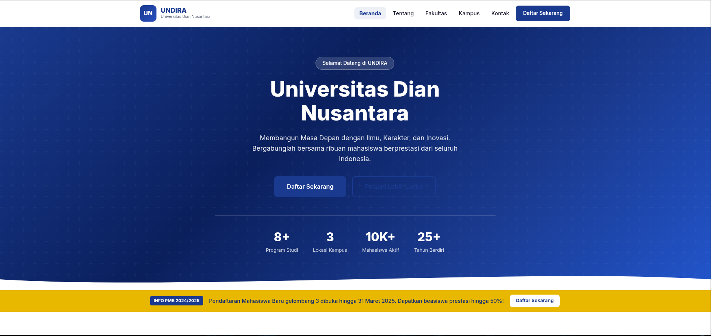
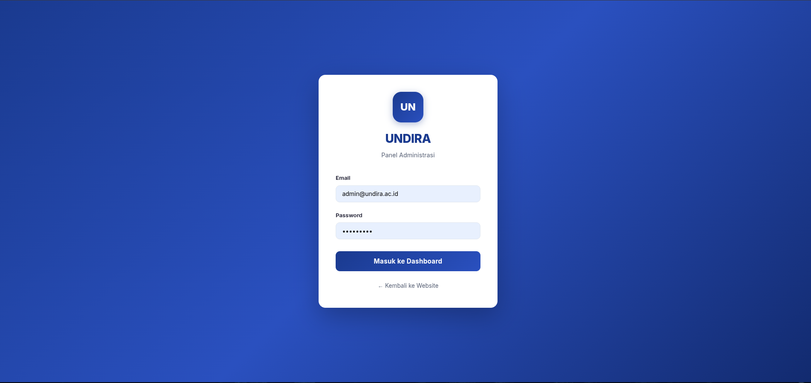
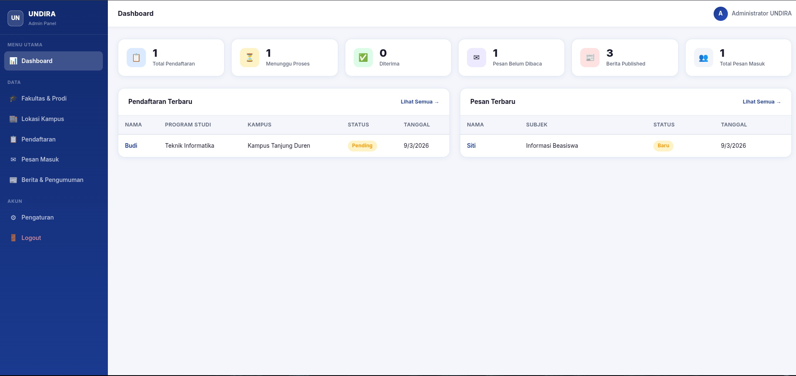

# 🎓 Website Universitas Dian Nusantara (UNDIRA)

Halo semua! 👋 Ini adalah project open-source **Website Clone Advance Version 1.0 Universitas Dian Nusantara**. Project ini dibangun menggunakan **Node.js** dan **SQLite** buat Bro & Sis yang mau belajar gimana cara bikin website kampus yang fungsional, ada landing page-nya, dan tentu saja ada Panel Admin buat kelola data.

---

## 📸 Preview Website

Berikut adalah beberapa tampilan website jika dijalankan di lokal:

### 🏠 Landing Page (Utama)

> Akses di: `http://localhost:3001`

### 🔐 Login Admin

> Akses di: `http://localhost:3001/admin/login`

### 📊 Dashboard Admin

> Di sini Bro & Sis bisa kelola berita, pendaftaran mahasiswa, pesan masuk, dan data kampus.

---

## 🛠️ Prepare Instalasi

Sebelum jalanin aplikasinya, pastiin Bro & Sis sudah install **Node.js** (rekomendasi versi 16 ke atas) di komputer kalian. Berikut cara install-nya di berbagai OS:

### 🐧 Linux (Distro Terkenal)
*   **Debian/Ubuntu:**
    ```bash
    sudo apt update
    sudo apt install nodejs npm -y
    ```
*   **Fedora:**
    ```bash
    sudo dnf install nodejs -y
    ```
*   **Archlinux:**
    ```bash
    sudo pacman -S nodejs npm --noconfirm
    ```

### 🍎 MacOS
Paling gampang pake [Homebrew](https://brew.sh/):
```bash
brew install node
```

### 🪟 Windows
1.  Download installer `.msi` di website resmi [nodejs.org](https://nodejs.org/).
2.  Pilih versi **LTS**.
3.  Install kayak biasa (Next-Next aja sampe beres).

---

## 🚀 Cara Running Project

Ikuti step by step santai ini:

1.  **Clone Repositori**
    ```bash
    git clone https://github.com/yudiiansyaah/undira-website.git
    cd undira-website
    ```

2.  **Install Library (Dependencies)**
    ```bash
    npm install
    ```

3.  **Setup Environment Variable**
    Copy file `.env.example` jadi `.env`:
    ```bash
    cp .env.example .env
    ```
    Buka file `.env`, terus ubah `PORT` jadi `3001` kalau mau sesuai permintaan:
    ```env
    PORT=3001
    SESSION_SECRET=bebas_isi_apa_aja
    ```

4.  **Running Website**
    *   **Mode Produksi:**
        ```bash
        npm start
        ```
    *   **Mode Development (Auto Refresh):**
        ```bash
        npm run dev
        ```

5.  **Buka di Browser**
    Cek di: `http://localhost:3001`

---

## 🔑 Akun Admin (Panel Dashboard)

Biar bisa masuk ke panel admin dan otak-atik datanya, pake akun ini ya Bro and Sis:

*   **URL Login:** `http://localhost:3001/admin/login`
*   **Email:** `admin@undira.ac.id`
*   **Password:** `Admin123!`

*(Jangan lupa ganti passwordnya di database kalau mau dipake beneran!)*

---

## 🛠️ Troubleshooting (Kalau Ada Error)

Kadang dunia coding gak seindah pelangi. Kalau dapet error, coba cek ini:

1.  **Error `better-sqlite3` saat `npm install`**
    *   **Penyebab:** Library ini butuh compile script C++ di komputer kalian.
    *   **Solusi (Windows):** Install "Build Tools for Visual Studio" atau jalankan `npm install --global windows-build-tools` di PowerShell (Run as Admin).
    *   **Solusi (Linux):** Pastiin udah install `build-essential` atau `base-devel`.

2.  **Port 3001 Sudah Terpakai**
    *   **Penyebab:** Ada aplikasi lain yang pake port itu.
    *   **Solusi:** Ganti `PORT=3001` di file `.env` jadi angka lain, misal `3005`.

3.  **Database Gak Muncul / Error Query**
    *   **Solusi:** Hapus file `database/undira.db` (kalau ada), terus restart aplikasinya. System bakal otomatis nge-seed (bikin ulang) database baru yang fresh.

4.  **Node.js Tidak Dikenali**
    *   **Solusi:** Pastiin bro and sis udah restart terminal/CMD setelah install Node.js supaya path-nya ke-update.

---

## 🤝 Kontribusi

Mau bantu kembangin? Gaspol! Silakan Fork repo ini, buat branch baru, terus kirim Pull Request (PR). Segala bentuk bantuan sangat dihargai!

**Semoga bermanfaat! 🚀**
# undira-website
